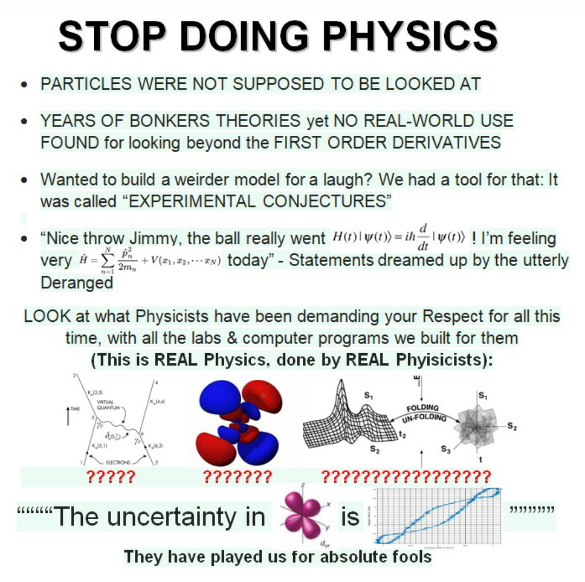
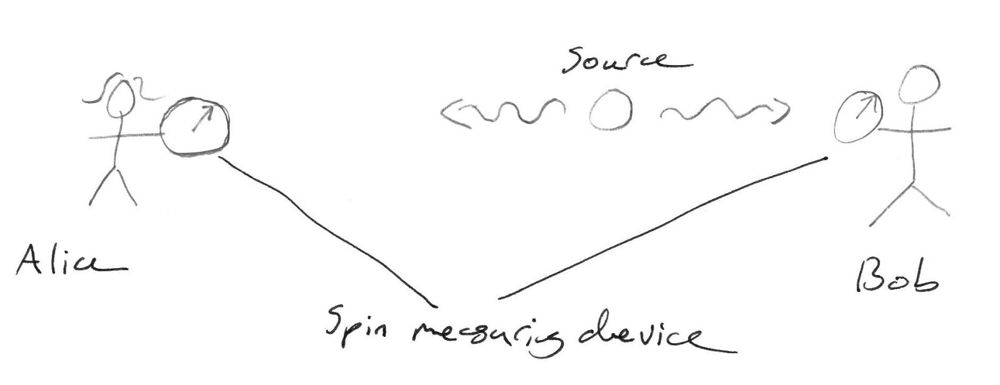

# Interpretations of quantum mechanics you've probably never heard of because I just made them up

## Quantum mechanics was created by Big Physics to sell more Physics

In 1900 Lord Kelvin (WiLiAm ThOmPsOn) said "There is nothing new to be discovered in physics now. All that remains is more and more precise measurement.". A statement which has been widely derided ever since.
Supporters of the Big Physics (BP) theory hold that he was actually correct and that physicists completely ran out of things to do after 1900. They had to make something up so they wouldn't lose all their funding.

    

While mainstream physicists claim their theories are backed up with rigorously gathered evidence, deniers point out that none of these effects can be seen by the naked eye, but are all demonstrated with easily faked lines on a computer screen. Have you ever seen a particle diffract??

## The Lazy evaluation hypothesis

This interpretation claims to resolve the EPR paradox. Consider David Bohm's version of the paradox. A pair of photons are generated in an entangled state, such that their spins are aligned in opposite directions. They are then sent off towards two different observers.

    

Alice and Bob both have devices that can measure spin along a particular axis, and let's say that Alice is much further away so Bob always completes his measurement first. If Alice measures her photon's spin along a random axis there is a 50/50 chance to find it spin-up or spin down. But if she finds it to be spin-up, when she later compares notes with Bob, it will always be the case that Bob found his to be spin-down along the same axis.

Thus it appears that the universe goes back in time to fix the result of Bob's measurement so it agrees with Alice's.

To explain this phenomenon, the Lazy Evaluation hypothesis was proposed by a clandestine group of functional programmers, known only as GHCxTHC. It suggests that this effect is the result of a programming trick used by the simulators running the universe. In order to save on compute, only phenomena that are directly observed by the subject of the simulation (Alice) are calculated. Thus the result of Bob's measurement is only simulated when Alice asks him for his answer, and it is made to be consistent with whatever else Alice has observed.

GHCxTHC have published a 17 line Haskell program which they claim will simulate an entire universe. No one has run it due to ethical concerns for the subjects of the simulation. Researchers believe they understand the first 3 lines of the program, and aim to reach line 5 by 2024.

## The principle of least action

*(Otherwise known as Quantum Meta-Darwinism)*

The anthropic principle notes that other universes could have different laws of physics, but that we could only find ourselves in one of the universes that is sufficiently ordered to allow for intelligent life. Proponents of the principle of least action further believe that a society where most people understand the fundamental nature of reality would inevitably collapse due to, in our case: nuclear war, AI, grey goo and the like.

Thus in order for us to live in a world with not only intelligent life but a long lasting civilisation, the laws of physics must be fine-tuned so as to prevent physicists from reproducing. This is achieved by keeping them locked in their offices calculating 12th order perturbation series, making them attracted to their cousins, and forcing them to spend a lot of time around high energy radiation which renders them infertile.

