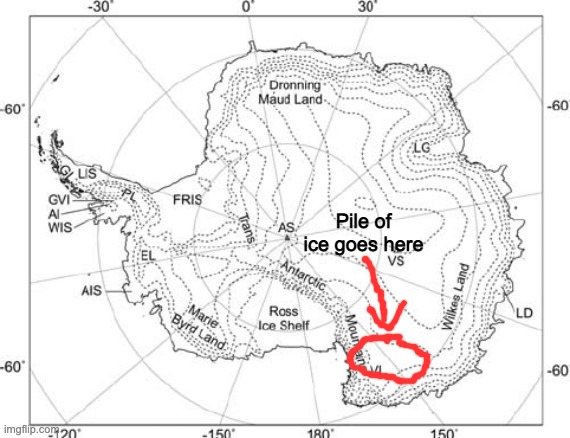
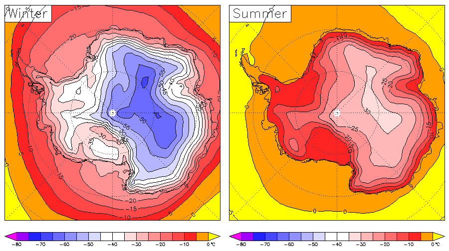

# Directly controlling sea levels

_“Let all men know how empty and worthless is the power of kings. For there is none worthy of the name but God, whom heaven, earth and sea obey”_ – King Cnut

Sea levels have been rising by about 3mm a year for the last few decades. That may not sound like much but if you consider the cumulative effect over a human lifetime… well it’s still not a huge amount. But anyway a lot of people are concerned about this and so preventing it would cheer them up, and besides, it’s just not dignified for an advanced civilisation to be beholden to nature in this way. We should be able to raise and lower the oceans simply because it suits our whims.

There are a number of proposals for low cost geoengineering techniques to either remove carbon dioxide from the atmosphere or directly cool the earth by reflecting sunlight, examples include:

 - <a href="https://en.wikipedia.org/wiki/Ocean_fertilization">Ocean fertilisation</a>
 - <a href="https://en.wikipedia.org/wiki/Stratospheric_aerosol_injection">Stratospheric aerosol injection</a>
 - <a href="https://en.wikipedia.org/wiki/Marine_cloud_brightening">Marine cloud brightening</a>

Yes these are all very clever and yes, they would obviously work. But if you only care about sea levels and not about anything else there is a much simpler way: pumping water out of the ocean. This is my plan.

The obvious place to put all this water it Antarctica. All you have to do is pump it inland a bit and let it freeze and then you never have to worry about it again. The other great benefit is that no-one lives there so I won’t have to spend forever getting people to agree to the project (bloody NIMBYs 😤). Again there are probably cheaper ways if you want to do something clever, but I’m not trying to win any prizes for efficiency here I’m just trying to get it done.

One problem with Antarctica for instance is that it’s very high up because of all the ice that is already there (the average elevation is 2500m), so you have to pump the water up a long way, but this has the side benefit that you don’t have to go that far inland before it gets really cold. The low temperature of Antarctica has as much to do with its altitude as its latitude.

    

    

Here’s a map of elevation and average temperature, there’s basically a one to one relationship. The south pole isn’t even that close to the coldest part, and there is a bit (circled) that is cold enough, pretty flat, and pretty close to the coast (a few hundred kilometres). So to flesh out my plan a bit more:

1. Suck up the water along the coast from below the sea ice
2. From there it goes through a series of pumping stations, each with their own (Nuclear) power station, to get it up the 100km or so of steep terrain
3. What to do with it once you get to relatively flat terrain is tricky, we can come back to that

The lower bound on how much this will cost is just paying for the energy required to pump the water. This means taking the top 3.4mm off the ocean and pumping it to some suitable location where it will freeze permanently. The surface area of the ocean is 310 million km^2. So that’s (3.4x10^-3 m) x (310x10^12 m^2) = 1.1x10^12 m^3. 1 trillion cubic metres or 1000 cubic kilometres, that’s a nice round number. And I can’t read the map exactly so let’s say we pump it up to the average elevation of 2500m.  (1.1x10^15 kg) * (9.8 ms^-2) * 2500m = 2.6x10^19 J in total, or 800GW continuously.

For comparison, global water freshwater usage is around 4 trillion cubic meters per year and global electricity production is around 2900GW on average, China and the US average 800GW and 500GW respectively. So it’s just quite a large amount of energy, not an insane amount. At US prices it would cost about $300b/yr. You argue that one couldn’t achieve those prices due to the extreme conditions, I point out that there would be almost no transmission costs and play “economies of scale” face down, ending my turn.

This is the theoretical lower bound on the energy required, assuming 100% efficiency of the pumps and not accounting for the friction losses in moving the water horizontally over land. But the actual amount may not be much more than that, pumps of the type used in hydroelectric plants are typically 90% efficient, and the very large volume of water involved means it can flow over long distances with very little energy loss. The energy lost due friction is inversely proportional to the diameter of the pipe it flows down, and this would require a very large pipe. For water flowing at 10m/s you would need a pipe 66m in diameter. Again though this is pretty big but not unimaginably so. Or you could have several independent pipes, you could offer an incentive per cubic metre of water delivered and allow the optimal pipe size to be set by the marke- look you get the idea.

So what do you do with 1000 cubic kilometres of water per year once you get it up the hill? well you need to put it in a big pile, a pile 100km across and 400m high. One way you could do this is by turning it to ice in giant cooling towers and then spreading it out with dumptrucks and bulldozers, we already do this sort of thing with ordinary earthworks. This has a problem though, if you want to create the ice in large stationary cooling facilities and also put it in a pile 400m high (per year!) you will need to transport it a very long distance over land. Another way which gets around this problem is to pump it through flexible hoses to exactly where it is needed and spray it out in layers onto the ice, you could avoid the need for much stationary infrastructure by powering the vehicles that do this using the hydraulic pressure of the water. Ten thousand little tractors scurrying over the ice laying down a pyramid that will stand for thousands of years, ah 😌

    

