# Foreword to the 1990 edition of How to Solve It

Last year I stumbled across a book that I had heard of in the university library, the 1990 edition of <i>How to Solve It</i> by George Polya. The book itself was good, but nothing I didn't expect. However the foreword keeps coming back to me, to the extent that I find myself looking it up a year later. I managed to find it online so here it is if you want to read it:

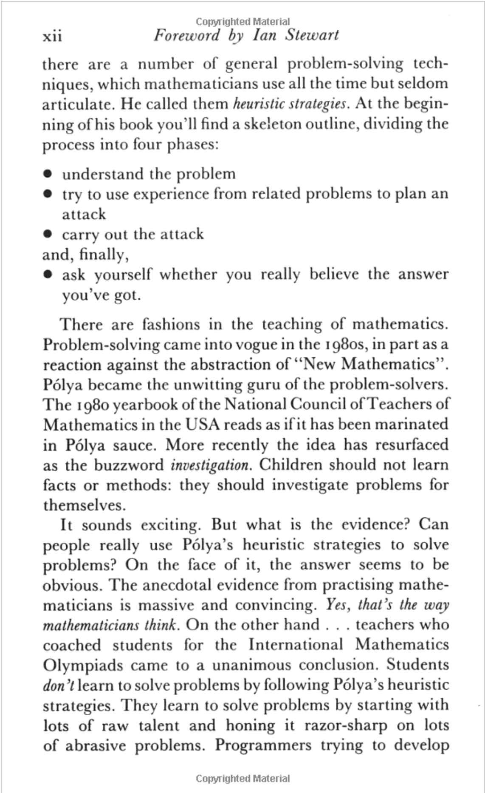

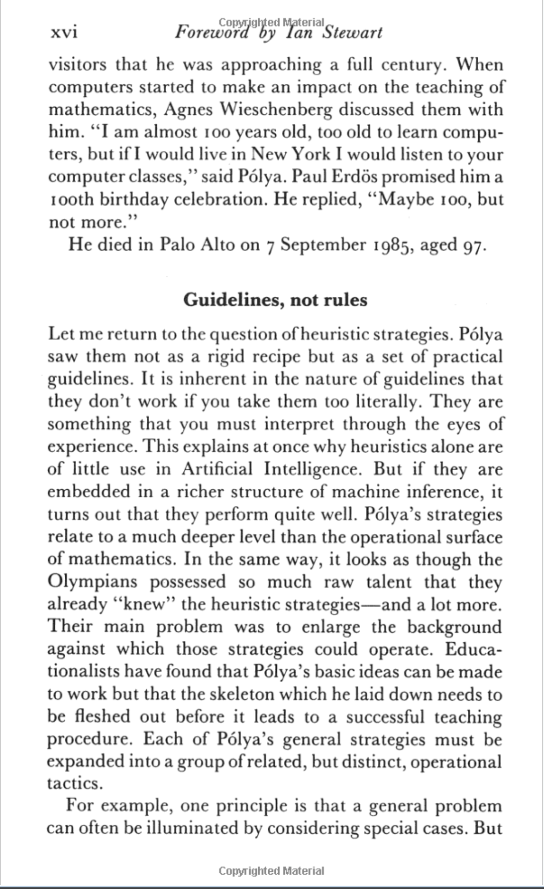
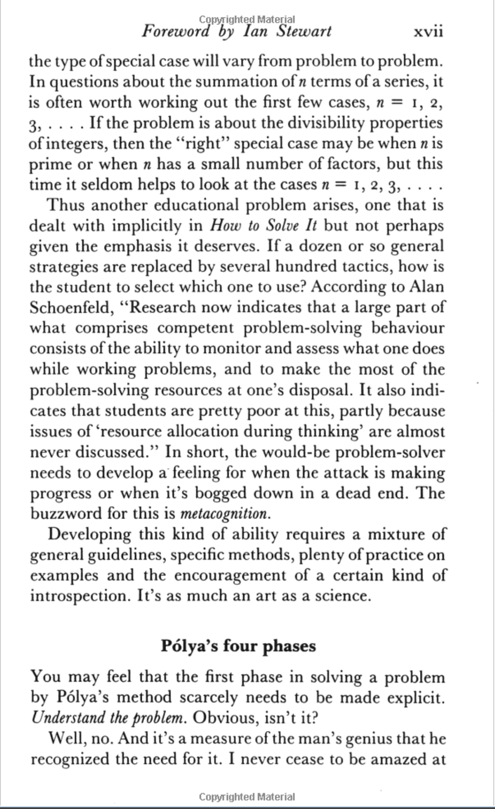
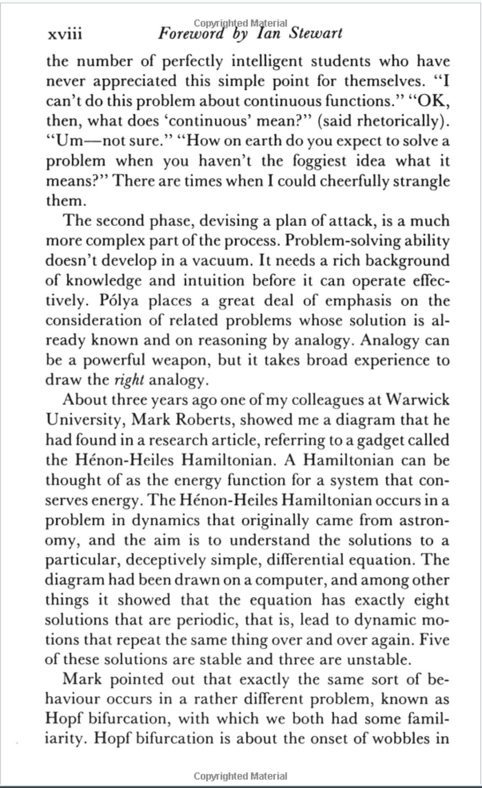

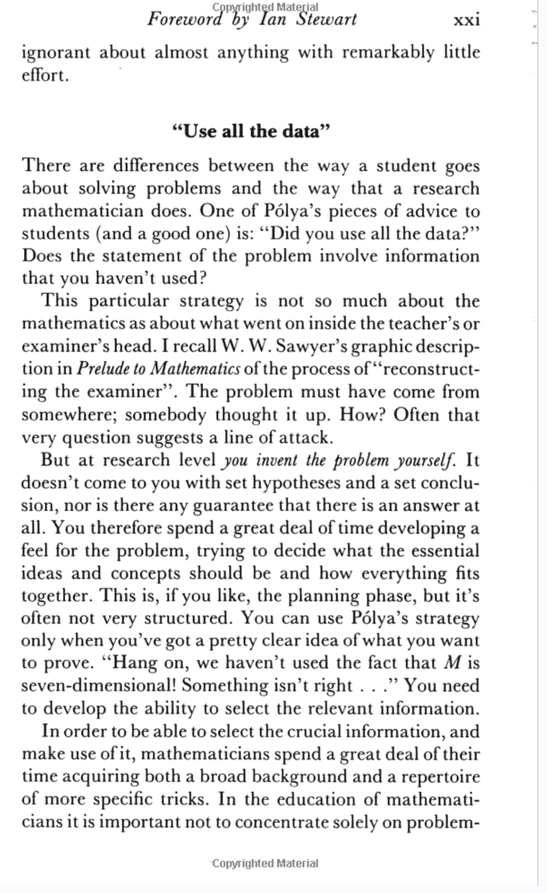
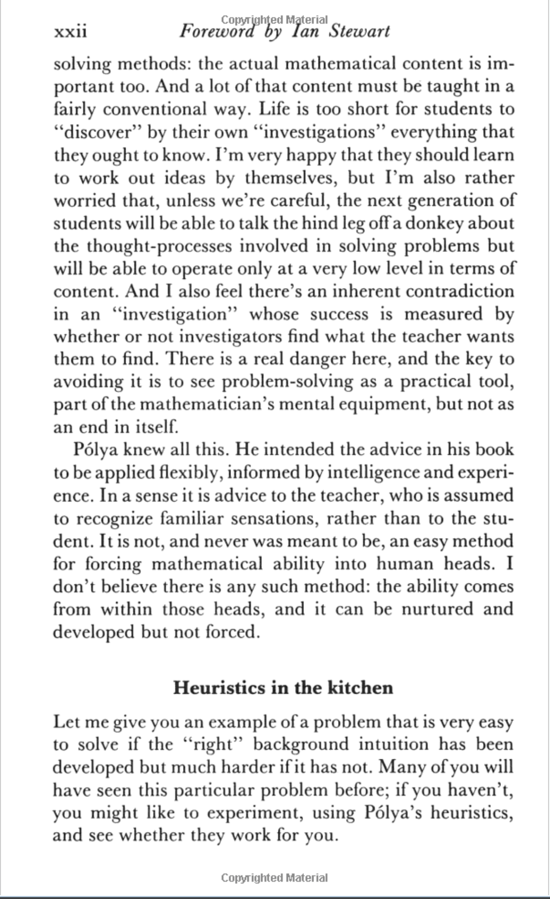
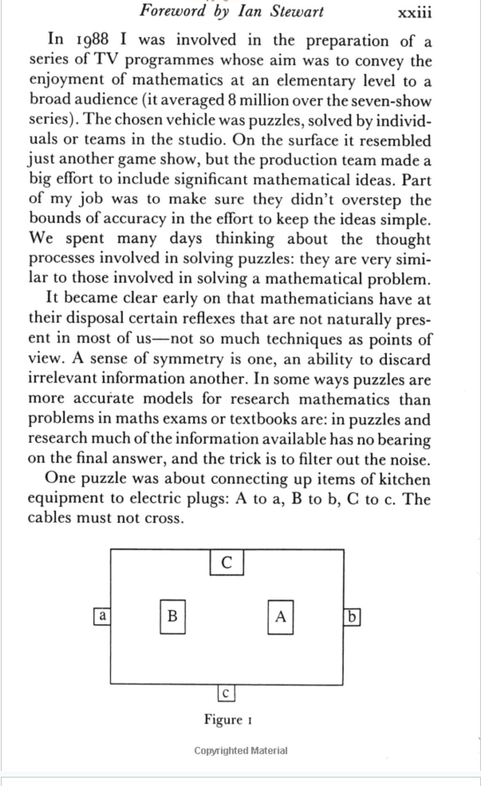
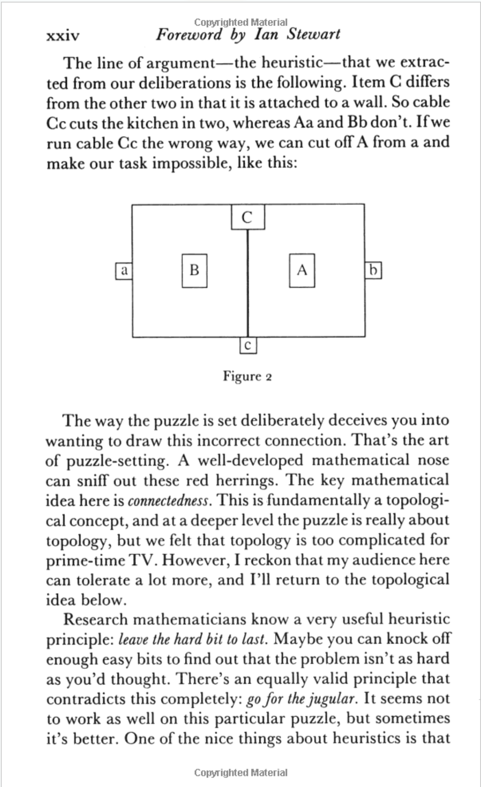
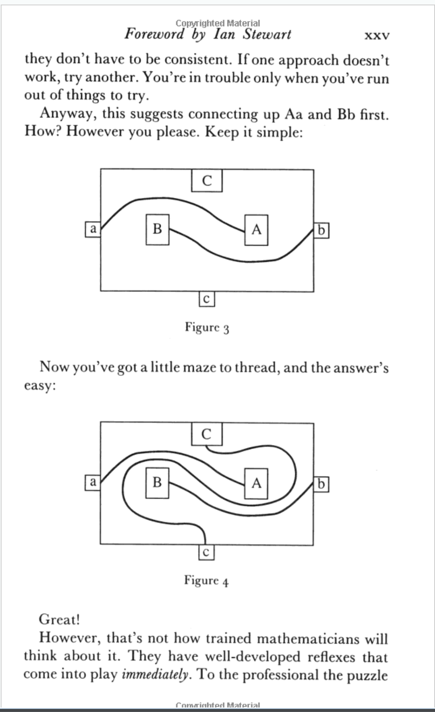
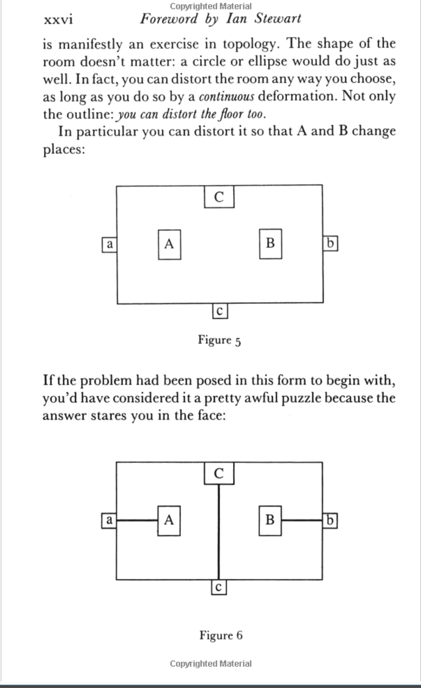
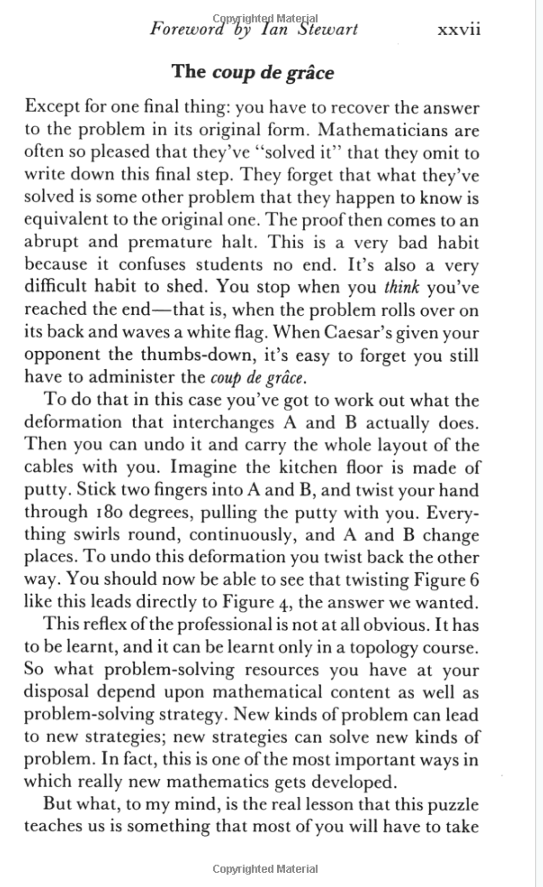

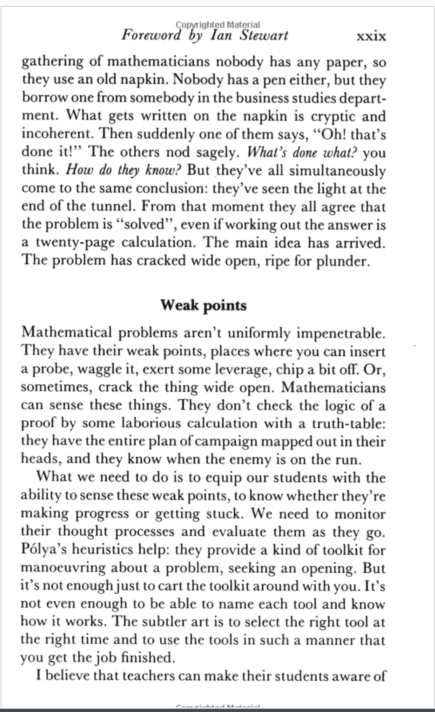
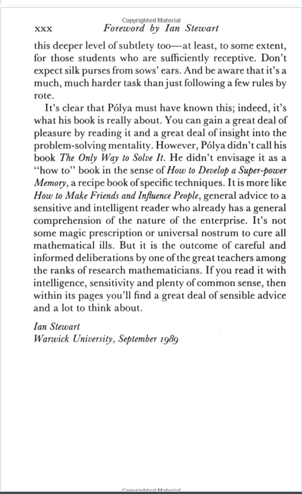