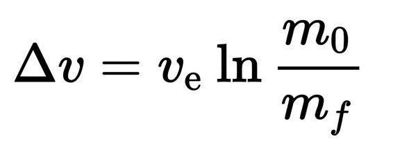
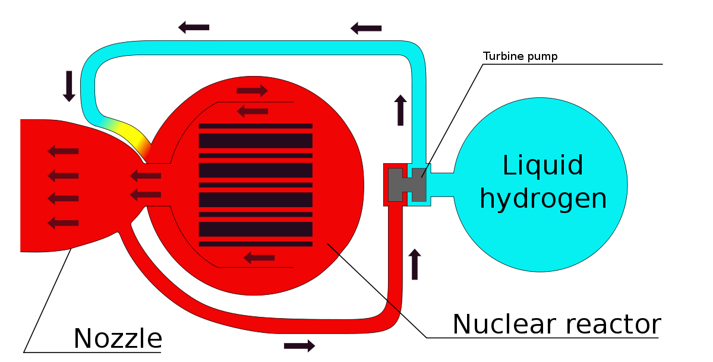
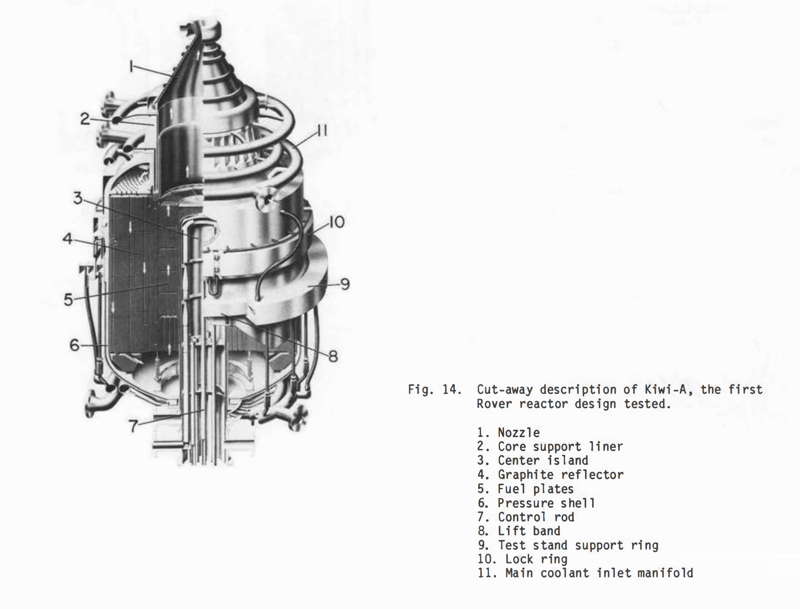
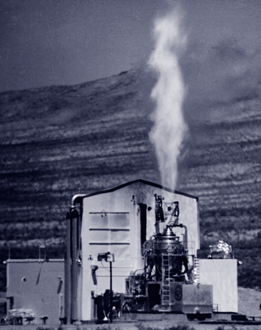
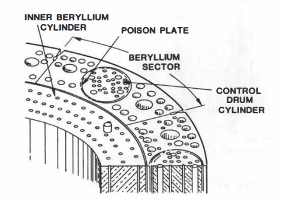
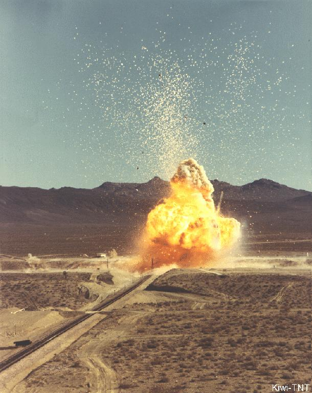
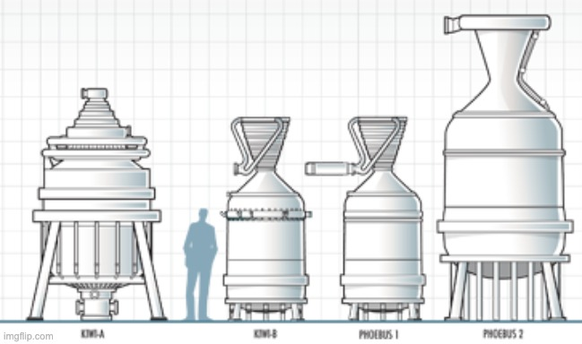
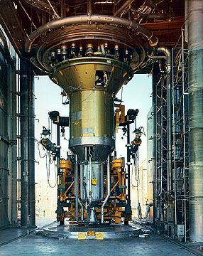

# Nuclear rockets that never were

They were really having fun with nuclear reactors back in the 60s, before everyone got all scared. One of the things they had a crack at was building nuclear powered rockets, which worked really well, and then they stopped doing them.

## Why nuclear power
You may have noticed rockets are very large, there is a reason for this, it has to do with maths. You see rockets need to get up to a very high speed to do what they need to do, and the speed one can get up to, as a rocket, is given by:

    

Where v_e is the exhaust velocity and m_0/m_f is the ratio of your initial to final mass. You may notice that m_0/m_f is inside a logarithm. So if you have a rocket that can get up to a certain speed with a mass ratio of 10 to 1, then someone came along and said you needed to double your final speed, you would need to square your mass ratio to 100 to 1. This would be a huge problem.

In 1960 america had rockets that could just about make it to orbit, with a delta_v of 8km/s, then JFK came along and said they needed to double their delta_v so they could get to the moon. This was a huge problem.

Clearly increasing exhaust velocity is far preferable to increasing m_0/m_f, you can double delta_v just by doubling the exhaust velocity. But the exhaust velocity of chemical fuels is fundamentally limited by the energy density of those fuels, and rockets were already very efficient at extracting this energy. The most efficient rocket engines have 70% thermal efficiency, much higher than any engine you would find in a car or power station (try to guess the most efficient air breathing engine ever built*). Most rockets at the time (and today) used kerosene-oxygen with an exhaust velocity of about 3km/s. The highest for any practical chemical fuel is 4.5km/s for hydrogen-oxygen, and it’s not even that practical.

Nuclear fuel however, has an energy density literally a million times higher, and so a nuclear powered rocket could achieve an exhaust velocity limited only by the melting point of the material it is made of. To actually propel the rocket forward you just need some inert fluid to flow through the reactor and pick up the heat it produces. Using hydrogen for this can achieve an exhaust velocity of around 10km/s before you even start messing around with esoteric materials and plasmas and shit. Clearly this was the way to go.

    

If this was happening today we would of course have a big think about this and decide that all this radioactive material flying through the air might hurt someone’s feelings. But this was the 1960s so JFK simply looked up from his pile of amphetamines, said It’s 👏 Time 👏 To 👏 Build 👏 adn they got cracking**.

## The early days
A nuclear rocket project had in fact been started quietly a few years earlier, in 1957. It was located in Los Alamos, Manhattan project country, under the codename Project Rover. By 1959 they had completed their first reactor, Kiwi-A***. The design was pretty cool

    

The fuel + moderator consisted of plates of graphite containing little beads of highly enriched uranium dioxide, which were stacked into cylindrical elements. Liquid hydrogen would enter at the top at a temperature of 22k, flow round the outside and then redirected up the central core of the reactor, reaching a temperature of over 2200K. In the very center there was an “island” of heavy water for extra moderation and a single control rod. This had to be kept below 100°C despite being surrounded by 2200K graphite, which makes it seem like a silly idea, they didn’t use it in later designs so it probably was.

This design was rolled out onto the jackass flats in Nevada to be tested July the 1st 1959, it was as you can see a resounding success.

    

The exhaust is kind of red because the hydrogen immediately ignites on contact with the atmosphere.

There were a few minor hiccups, the plate of graphite that held the fuel elements in was shattered and ejected out of the nozzle, this resulted in hydrogen flowing around randomly inside the reactor, some of it bypassing the core entirely and not being heated very much. Because the test setup was targeting a certain outlet gas temperature this means the gas that was flowing though the core was heated to well above the design temperature (possibly up to 2900K), which started to erode some of the fuel plates. But broadly speaking it was all fine.

## Rocky 3 development montage
With the Concept thoroughly Proven, development of better reactors, and trying to put those reactors in rockets, proceeded in earnest.

On the reactor side the 100MW Kiwi-A morphed into the 1100MW Kiwi-B, losing the weird central island and switching from stacked fuel plates to extruded sections of graphite which were less susceptible to erosion. Instead of a control rods control “drums” were used, which sat around the outside of the reactor and had a neutron reflecting material (beryllium) on one side and a neutron absorber on the the other side (called the “poison plate” in this diagram).

    

There continued to be the odd problem with bits of reactor being fired out of the nozzle, but by 1964 they had pretty much cracked it and the final Kiwi-B reactor was able to run for 10 minutes at a time without any problems. The only limitation being the amount of liquid hydrogen they had at the test site.

Even at the time there was a bit of concern about the radiation hazard if one of these reactors went out of control, so they decided to blow one up so see what would happen. They decided that it would be fine.

    

After the Kiwi reactors had shown what was possible, the next series of reactors aimed to increase the exhaust velocity, power density, and total power that could be achieved. These were called Phoebus, and had a broadly similar design to the Kiwi-B reactors, but with more of the hydrogen forced through the core of the reactor to increase the outlet temperature. This program culminated with the overwhelmingly powerful Phoebus-2A. With a design thermal power of 5000MW it was the most powerful reactor of *any* kind at the time, and it still is****.

    <iframe width="728" height="410" src="https://www.youtube.com/embed/LjU9kP_zd70" title="YouTube video player" frameborder="0" allow="accelerometer; autoplay; clipboard-write; encrypted-media; gyroscope; picture-in-picture" allowfullscreen></iframe>

This was tested successfully for 12.5 minutes in July 1968, again only limited by the amount of hydrogen available to run it (it consumed 120kg per second at full power).

This grainy image shows all these reactors next to a guy, despite being more powerful than a reactor that needs a whole power station build around it, the Phoebus 2A was only about 2 guys tall and weighed about 10 tons!

    

These reactors were not exactly rockets though, they were still hooked up to a lot of external pumps and control systems, another development program ran in parallel to try and develop an engine that could actually be put on a rocket. This program was called NERVA (Nuclear Engine for Rocket Vehicle Application) and the engines that were built were based on the Kiwi-B design, but with all the pumps and other hardware moved into the rocket engine itself.

    

This is the NERVA XE, the pinnacle of achievement for the whole program. It already looks a lot more like a rocket engine, it’s pointing the right way for one thing. It was tested in 1968 and was able to achieve an exhaust velocity of around 7km/s, roughly double that of the best chemical rockets. This is still far off what is theoretically possible, or even what the Phoebus reactors could reach, but more importantly this was a self-contained, reliable rocket engine that could be throttled and restarted in flight.

## The beginning of the end
The NERVA XE would be a prime choice for the upper stage of a lunar rocket, increasing by many times how much mass could be carried to the surface of the moon. For more ambitious missions, such as going to mars, or building a lunar base, it was not just an attractive option but pretty much the only way it could be done. NASA had all these plans in 1968, with a visit to mars planned by 1978, and a moon base by 1981, with NERVA and its derivatives at the core of the program.

Unfortunately it was not quite ready in time for the Apollo 11, and the decision had already been taken in the mid 60s to count on chemical rockets for the first few missions. Once it became clear that america was going to win the space race, enthusiasm and funding for the projects quickly dried up. Production of new Saturn Vs, the ideal launch vehicle for a nuclear upper stage, had already been halted before Apollo 11 was even launched. NERVA limped on until 1972 when it was declared a resounding success, and then cancelled.

Over the following decades the level of technological capability in both rockets and nuclear reactors rapidly declined, with designs for both becoming more complex, more expensive, and worse. Rocket technology now seems to have bounced back but the combined forces of all the competent people retiring, and concerns about the dangers of radiation reaching superstitious levels mean that we may not see a nuclear powered rocket fly in our lifetimes.

*it’s the Rolls-Royce/Snecma Olympus 593 which powered the concorde, with a thermal efficiency of 43%. It achieved such a high efficiency because colder intake air gives higher efficiency, and it operated higher than any other aircraft, where the air was much colder. huh interesting.

…ok before you start complaining it was actually the most efficient normal thermodynamic machine (whatever the fuck that means), at the time, according to the autobiography of the guy who made it. But still, the point I’m trying to make is that high performance, low power to weight ratio does not equate to low efficiency. Modern F1 engines for instance are about 50% efficient. One way to get more power out of the same sized engine is to make it more efficient. The other point I am trying to make is that thermal efficiency numbers never get near 100%.

**This is all basically true but there is a very powerful pdf, https://nuke.fas.org/space/la-10062.pdf , that has a more accurate telling of the whole thing

***named after the ground nesting bird because it was never intended to fly

****Look,