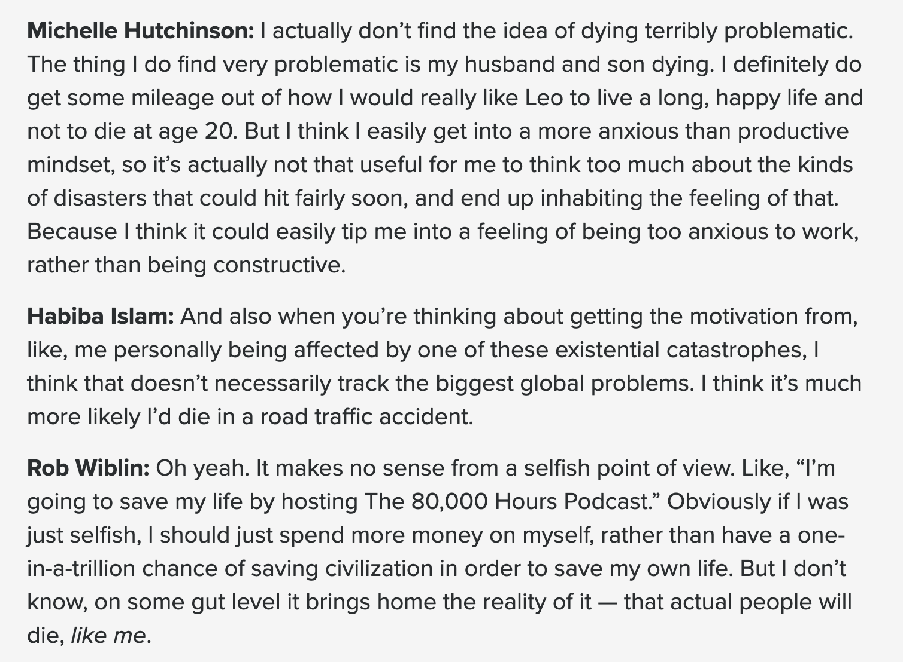

# You are personally fairly likely to die in a global catastrophe

There’s a bit in [this 80k podcast episode](https://80000hours.org/podcast/episodes/michelle-hutchinson-habiba-islam-themes-from-careers-advising/) where Wiblin and friends talk about whether they are motivated by the fear of personally dying in one of the big global catastrophes they are concerned about, and they basically conclude that no, they are not.  

    

 

This was surprising to me, because the mainstream beliefs of both EA/rationalists and normal people imply that the chance of dying in a big global catastrophe is actually pretty high.  

A [lot](https://80000hours.org/podcast/episodes/toby-ord-the-precipice-existential-risk-future-humanity/?startTime=5794&btp=904c1341) [of](https://thebulletin.org/2021/03/an-existential-discussion-what-is-the-probability-of-nuclear-war/) [people](https://www.metaculus.com/questions/2797/will-no-non-test-nuclear-weapons-be-detonated-by-start-of-2024/), including [domain experts](https://forum.effectivealtruism.org/posts/W8dpCJGkwrwn7BfLk/nuclear-expert-comment-on-samotsvety-nuclear-risk-forecast-2), claim that the annual risk of nuclear war is something like 0.1-3%, you can easily get into this range just on a strictly base rates basis (in the 75 or so years since they were invented, 2 have been used in war, and there have been 2 very close calls). A nuclear war wouldn’t necessarily mean that you personally would die, but it does come with a pretty high risk.  

The median estimate for the development of general AI in Ajeya Cotra’s widely endorsed [report](https://www.alignmentforum.org/posts/KrJfoZzpSDpnrv9va/draft-report-on-ai-timelines) is 2050. Again maybe we solve the alignment problem and everyone survives this, but [what are the chances of that](https://twitter.com/frances__lorenz/status/1507890341189505041?s=20&t=pQSyH0nDYcBnuf6jkPDpFg), 10%, 90%? It’s definitely not 99%.  

On the general public side, when people are [surveyed](https://forum.effectivealtruism.org/posts/rmKwTzX5XLGs94fcB/public-opinion-about-existential-risk) they claim to believe that the chance of human extinction in their lifetime are in the single digit percentages, which is actually pretty close to the [EA/rationalist consensus](https://forum.effectivealtruism.org/posts/27aXsJRRAoNZFw9K3/). Although this varies wildly from survey to survey, and people put perhaps too much weight on [the bees disappearing](https://twitter.com/YouGov/status/1493892853285728257?s=20&t=0N5h52Q-ElwWJZDNGYlrGw).  

Ok obviously the general public are just lying about their beliefs to signal… something, but if you are a healthy person in your 20s or 30s, and you believe there is even a 0.1% chance of a global catastrophe killing you in any given year, then this is your dominant risk of death!  

I am
<select style="width: 4em" id="sex">
    <option value="male">Male</option>
    <option value="female">Female</option>
    <option value="other">Other (average)</option>
</select>

I am <input style="width: 2em" id="age"></input> years old

I believe that the annual risk of a catastrophe that kills 10% of people like me is <input  style="width: 4em" id="risk_10_per"></input>%

I believe that the annual risk of a catastrophe that kills 99+% of people like me is <input  style="width: 4em" id="risk_99_per"></input>%

<button id="calculate-button" type="button" onclick="setParams()">Calculate my risk</button>  

  

  

For comparison, the years of life you can expect to lose due to car accidents is around [0.2](https://injuryprevention.bmj.com/content/26/Suppl_2/i46#DC5), and only [3 years of life](https://news.usc.edu/55969/delayed-aging-is-better-investment-than-cancer-heart-disease-research) would be gained per person from completely curing cancer. Quitting smoking is about the biggest expected lifespan increase an individual can achieve, at 35 will [increase your life expectancy by 7-8 years](https://www.ncbi.nlm.nih.gov/pmc/articles/PMC1447499/), which is only helpful if you smoke to begin with. Quitting drinking for alcoholics, and losing weight for obese people also come with similarly large life extensions, but again if these things don’t apply to you then there is not much you can do.

So if you are young and healthy and are at all concerned about not being hit by a car, not taking a drug overdose, or not killing yourself (these are the things that young healthy people die of) then it does make sense to be personally concerned about dying in a nuclear war or other large disaster.

## Why don’t people act like this is the case?

I think there are a few things going on. The most significant is that no-one has ever experienced a global catastrophe, and most have never even experienced a “local” catastrophe, like an earthquake or a civil war. Whereas most people do at least know someone who has been in a car accident. If your risk is strongly correlated with everyone around you then you will never hear a story of a friend of a friend who foolishly moved to a strategically important area and was killed by a nuclear bomb, you will just suddenly be killed along with everyone else one day.

Another thing is that we have all been marketed the very compelling steelman case for caring about x-risk, which goes like this: “even if there is a vanishingly small chance of an x-risk occurring, the consequences would be so bad (because humanity would be extinct forever) that the expected cost is still high, and so it makes sense to invest a lot of resources into preventing it”.

This is of course a correct argument to counter people who say that true x-risks just seem sort of unlikely, even if the risk to an individual was so small as to be not worth caring about, the combined risk would still be worth caring about, ooh clever. But if most people who agreed with this argument interrogated their beliefs they would find that they don’t actually think the risk of a major catastrophe is vanishingly small, but just pretty small, and well within the range of other small risks that they care about.

The final thing is this cope that “there’s not much you can do about it anyway” so it’s not worth caring about. This is not true. Absent a truly humanity extincting catastrophe, in most cases there are things you could do to lower your risk dramatically. For nuclear war you can move to a less strategically important area, or have a plan to do so in the event that the vibes start to look off. For pandemics you can stock up on masks and other supplies to prepare for a potential quarantine. For famine risks (supervolcanos, climate stuff) you can stock up on food.

By comparison trying to extend your life by lowering your risk of cancer or avoiding car accidents don’t look any more tractable. In the cancer case there are lots of things with spurious evidence that might work, and a couple of things (like quitting smoking and drinking) with fairly strong evidence, but you’re going to have to make huge lifestyle changes to gain at most 3 years of life expectancy. And for car accidents the expected years of life lost are just not that high to begin with, so it’s not worth putting much effort into.

## How should this change your behaviour?

I’ve been a bit fast and loose with figures and assumptions and you may take issue with the linked sources, but the exact numbers are not that important, the basic point is this:
You have maybe 1-5 years of life to gain in expectation from making lower risk “lifestyle choices”, if you are not already doing anything really dangerous or unhealthy
If you hold fairly normal beliefs about the risk of major catastrophes, then you also stand to lose about 1-10 years due to catastrophic risks
There is no strong reason to think that extending your life through healthy lifestyle choices is much more tractable than trying to avoid catastrophic risks

The logical conclusion of this is that if you are currently putting zero effort into avoiding catastrophic risks, and some effort into having a healthy lifestyle with the goal of living longer, then you should try to bring these into balance. Consider driving more recklessly, making an escape plan for when a nuclear war looks imminent, or taking up recreational drugs.